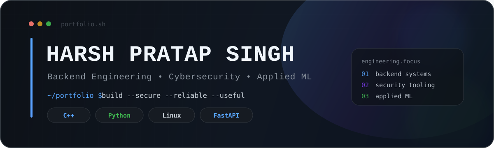

<div align="center">



<br />

**Computer Science @ MANIT Bhopal**  
Building backend systems, security tooling, and applied machine-learning products.

<br />


</div>

---

## `~/about $ whoami`

> **Harsh Pratap Singh** — Computer Science student interested in the engineering behind reliable backends, security systems, and practical ML products.

```text
focus/
├── backend-engineering    APIs · distributed flows · infrastructure
├── cybersecurity         monitoring · detection · anomaly analysis
├── applied-ml            model pipelines · evaluation · integration
└── systems               C++ · Linux · networking · media streaming
```

I enjoy projects where the interesting part sits **behind the interface** — architecture, data flow, reliability, performance, and security.

---

## `~/portfolio $ ls featured/`

<table>
<tr>
<td width="50%" valign="top">

### 🛡️ FinSecOps

Security monitoring and risk-detection prototype combining deterministic security rules with **Isolation Forest** behavioral anomaly detection, risk scoring, persistent events, and a Streamlit dashboard.

`Python` `scikit-learn` `Isolation Forest` `SQLite` `Streamlit`

**[Explore repository ↗](https://github.com/beasthphp/FinsecOps)**

</td>
<td width="50%" valign="top">

### 🎵 Distributed Audio Platform

Backend audio pipeline where FastAPI accepts MP3 uploads, a Python worker validates and transcodes media with FFprobe/FFmpeg, and a **C++ HTTP server** handles processed audio streaming.

`C++17` `Python` `FastAPI` `FFmpeg` `CMake`

**[Explore repository ↗](https://github.com/beasthphp/distributed-audio-platform)**

</td>
</tr>
<tr>
<td colspan="2" valign="top">

### 🧠 Human-Face Deepfake Detection

End-to-end deepfake-detection MVP with face preprocessing, TensorFlow/Keras inference, a local FastAPI service, and a **Chrome Manifest V3 extension** for per-face webpage analysis. The model layer is intentionally replaceable so stronger models can be integrated without changing the extension/API contract.

`Python` `TensorFlow` `Keras` `OpenCV` `FastAPI` `Chrome Extension`

**[Explore repository ↗](https://github.com/beasthphp/deepfake_detector_2.0)**

</td>
</tr>
</table>

---

## `~/portfolio $ ls work-in-progress/`

> 🚧 These projects are active builds and are still being refined.

<table>
<tr>
<td width="50%" valign="top">

### ⚡ Distributed API Gateway

API gateway project exploring rate limiting, API-key management, asynchronous usage processing, observability, reverse proxying, and deployment infrastructure.

`Redis` `PostgreSQL` `Prometheus` `Grafana` `Docker` `Nginx`

**[View work in progress ↗](https://github.com/beasthphp/distributed-api-gateway)**

</td>
<td width="50%" valign="top">

### 🎧 SongSpot.in

Indian song guessing game with progressive **0.1s → 0.5s → 2s → 5s → 8s** reveal stages, category-based gameplay, a React/TypeScript frontend, and a FastAPI backend.

`React` `TypeScript` `FastAPI` `PostgreSQL` `Redis` `Docker`

**[View work in progress ↗](https://github.com/beasthphp/songspot)**

</td>
</tr>
</table>

---

## `~/stack $ cat toolkit.txt`

| Area | Toolkit |
| --- | --- |
| **Languages** | C++, Python, JavaScript, TypeScript, SQL |
| **Backend & Data** | FastAPI, REST APIs, Redis, PostgreSQL, SQLite |
| **Systems** | Linux, Docker, Nginx, FFmpeg, CMake, HTTP |
| **Cybersecurity** | Network Security, Security Monitoring, Threat Detection, Anomaly Detection |
| **Machine Learning** | scikit-learn, TensorFlow/Keras, OpenCV, pandas, NumPy |

---

<div align="center">

### `build > learn > break > improve`

`Backend Engineering` · `Cybersecurity` · `Systems Programming` · `Applied ML`

<sub>Interested in systems that are useful to build, measurable to test, and interesting to explain.</sub>

</div>
